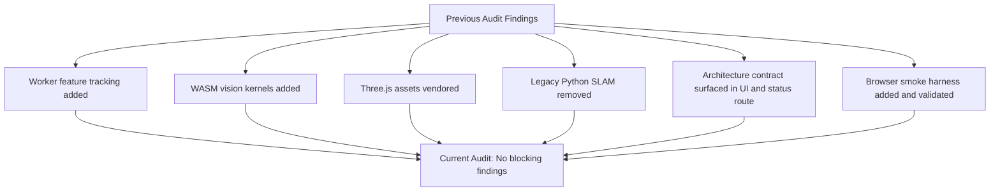
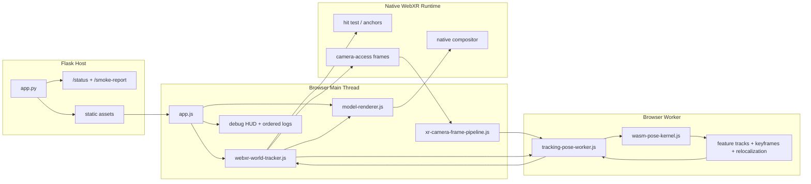
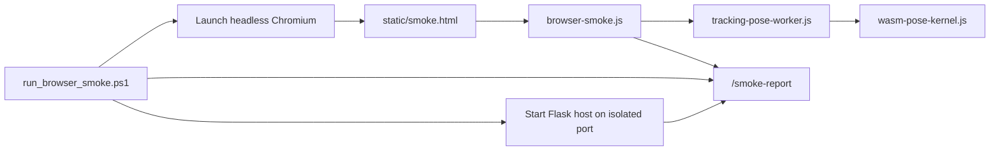

# Codebase Audit

Date: 2026-03-09

## Executive Summary

The repo is now aligned around one strict runtime: client-side WebXR world tracking with a browser worker, repo-owned WASM vision kernels, raw XR camera ingestion, worker-side feature tracking, lightweight keyframe/map state, vendored runtime assets, and an isolated browser smoke harness.

All blocking findings from the previous audit pass are resolved in the current repo state. The remaining work is research work toward 8th Wall-class parity, not repo misconfiguration.

## Audit Outcome

- Status: previous audit findings closed
- Tracking hot path: browser only
- Fallbacks: none by design
- Assets: vendored locally
- Legacy Python tracking stack: removed
- Browser automation: present and passing

## Resolution Map

## Resolved Findings

### 1. Visual ingestion was present, but feature tracking was missing
Resolved.

`static/js/tracking-pose-worker.js` now detects features on worker-ingested XR camera frames, builds small descriptors, matches tracks across frames, estimates relative motion, stores keyframes, maintains landmarks, and relocalizes against stored keyframes.

### 2. The WASM layer was only scalar filter math
Resolved for the current scope.

`static/js/wasm-pose-kernel.js` now exports `rgbToLuma3`, `gradientEnergy4`, `cornerScore8`, and `descriptorDistance4` in addition to the original blend/filter helpers. This is still not full VIO, but it is no longer only scalar pose-filter math.

### 3. Raw camera access was acting like an accidental limitation
Resolved as an explicit design contract.

The product direction is strict no-fallback operation. `camera-access`, `Worker`, `WebAssembly`, and `XRWebGLBinding` are now surfaced intentionally through `/status` and the debug UI as required runtime capabilities.

### 4. Frontend runtime depended on CDN-hosted Three.js assets
Resolved.

Three.js, `GLTFLoader`, and `OrbitControls` are now vendored in `static/vendor/` and loaded locally by the app and alignment tool.

### 5. Dormant Python SLAM code remained in `src/`
Resolved.

The unused Python SLAM stack was removed. The backend is now a static host plus diagnostics/status endpoints only.

### 6. Architecture validation was only possible on a live device
Mitigated to the repo boundary.

Live `immersive-ar` behavior still needs device testing, but the repo now has ordered runtime logs, a visible architecture contract in the UI, `/status`, `/smoke-report`, and a browser smoke harness for non-device validation. That means this is no longer a codebase misconfiguration.

### 7. Browser automation was missing for the worker/WASM runtime path
Resolved.

`scripts/run_browser_smoke.ps1`, `static/smoke.html`, and `static/js/browser-smoke.js` now validate worker initialization, WASM kernel availability, feature extraction, matching, keyframe creation, relocalization, and pose update in a real headless browser session on an isolated port.

## Active Runtime

## Verification Evidence

### Browser Smoke Harness

The browser smoke harness now passes with a real headless Chromium run on an isolated local port.

Latest passing evidence from `smoke-output.json` before cleanup:
- worker ready: `READY`
- wasm ready: `READY`
- feature count: `39`
- track count: `39`
- match count: `28`
- keyframe count: `1`
- relocalization score: `1.0`
- pose confidence: `0.734`

### Architecture Contract

`/status` now returns:
- `build_signature: research-webxr-worker-wasm-owned-target-20260311d`
- `tracking_mode: webxr-camera-access-worker-owned-image-target`
- `server_tracking: false`
- `no_fallbacks: true`
- `asset_mode: repo-vendored-threejs`
- `feature_count: 19`
- `required_capability_count: 7`

### Validation Flow

## Current Research Boundaries

These are not audit failures. They are the remaining research gaps to reach 8th Wall-class behavior.

- The browser still relies on native WebXR world tracking for base world/camera poses.
- The worker map is a lightweight image-space/keyframe structure, not a full 3D SLAM map with bundle adjustment and loop closure.
- IMU is visible in diagnostics but is not fused into the estimator.
- There is no cross-session map persistence or cloud localization.
- There is no semantic scene understanding, depth mesh, or VPS layer.
- The current relocalization path is descriptor-based and local, not global-scale map localization.

## Missing for 8th Wall-Class Parity

1. Replace native world-pose dependence with repo-owned visual-inertial estimation.
2. Lift the current landmark store into a persistent 3D map with optimization and loop closure.
3. Fuse IMU into the estimator instead of keeping it as debug telemetry.
4. Add session persistence, relocalization memory, and map reuse.
5. Add richer scene understanding such as depth, occlusion, and VPS when product scope needs it.

## Recommended Research Next Steps

1. Promote the current 2D worker map into a metric 3D state with triangulated landmarks and camera pose refinement.
2. Add IMU preintegration and visual-inertial update steps inside the worker pipeline.
3. Introduce keyframe selection and local bundle adjustment instead of heuristic keyframe retention only.
4. Expand relocalization from descriptor matching to map-backed pose recovery.
5. Add a device-run experiment log so live `immersive-ar` measurements feed back into the research loop with reproducible settings.
