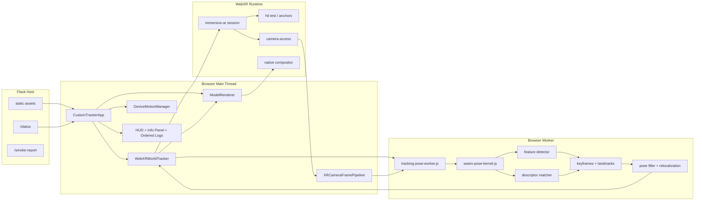
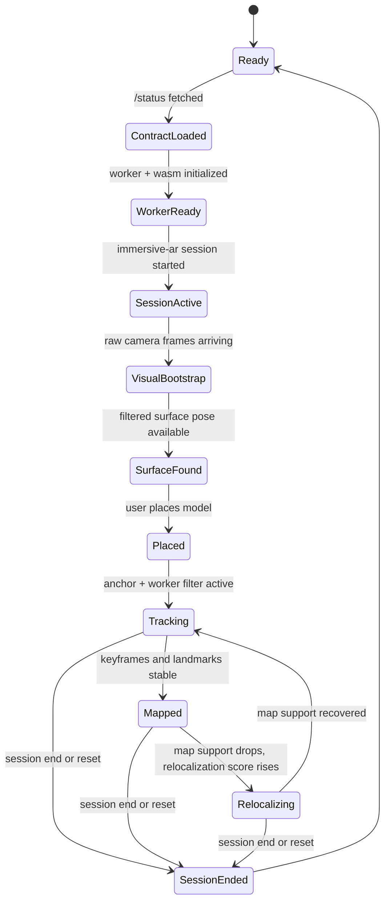
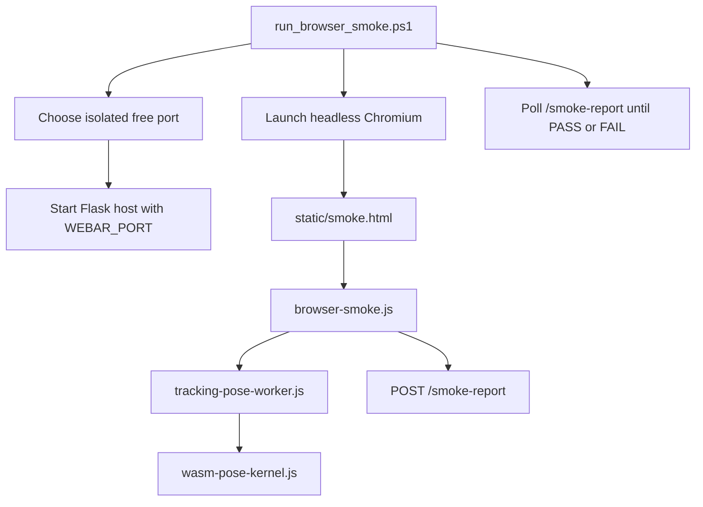
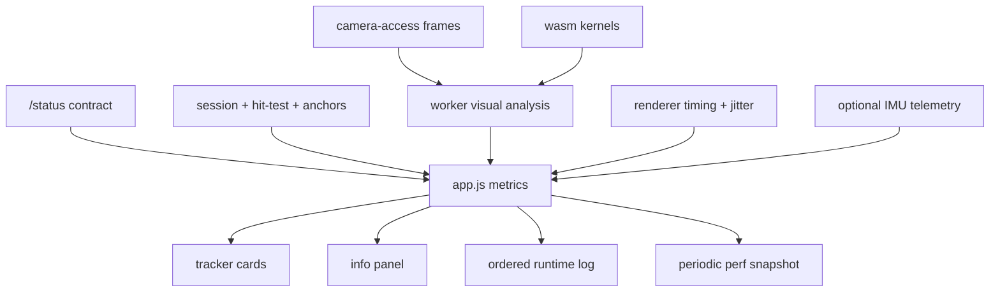

# System Design

Date: 2026-03-09

## Overview

The active system is a strict client-side runtime:
- WebXR provides world tracking, hit tests, anchors, camera access, and display timing.
- The browser worker owns repo-side pose filtering, feature extraction, matching, keyframe state, relocalization scoring, and visual diagnostics.
- The WASM module provides low-level math and vision kernels used by the worker.
- Flask is only a static host plus status and smoke-report endpoints.
- There are no fallback tracking paths.

## Runtime Contract

## Runtime Architecture

## Session and Tracking Flow

## Browser Validation Architecture

## Component Responsibilities

### `app.py`
- serves the web app and vendored runtime assets
- exposes `/status` as the architecture contract
- exposes `/smoke-report` for browser smoke validation
- is not part of the tracking hot path

### `static/js/app.js`
- bootstraps the app and fetches the architecture contract
- coordinates session start, UI state, runtime summaries, and ordered logs
- surfaces worker, wasm, visual, capture, architecture, and render diagnostics together
- tunes capture size and cadence to protect XR frame rate

### `static/js/webxr-world-tracker.js`
- requests the `immersive-ar` session with required features
- manages hit tests, placement, optional anchors, worker messaging, and session diagnostics
- routes both pose measurements and visual frames into the worker
- consumes worker-filtered poses only

### `static/js/xr-camera-frame-pipeline.js`
- captures raw XR camera textures through `XRWebGLBinding.getCameraImage()`
- downsamples on GPU, reads back on CPU, and backpressure-limits worker submission
- keeps visual ingestion separate from XR compositor scale so quality and performance can be tuned independently

### `static/js/tracking-pose-worker.js`
- decomposes measurement matrices into translation and rotation state
- extracts image features on a grid from raw frames
- builds tiny descriptors, matches tracks, estimates image motion, and updates map state
- stores keyframes and lightweight landmarks
- computes relocalization support and feeds it into pose confidence
- returns filtered poses plus dense debugging metrics

### `static/js/wasm-pose-kernel.js`
- builds a small in-repo WebAssembly module without external tooling
- exports scalar helpers plus vision kernels used by the worker
- currently accelerates luminance, gradients, corner score, descriptor distance, and filter math

### `static/js/model-renderer.js`
- owns Three.js scene setup, model loading, XR-compatible rendering, and world-space model transforms
- consumes only filtered poses from the world tracker
- reports frame time, pose age, jitter, and render state back to the app

### `static/js/device-motion.js`
- collects optional motion telemetry for debugging
- is intentionally not a fallback tracker
- is a candidate source for future visual-inertial fusion experiments

### `static/index.html`
- exposes the start flow, tracker cards, architecture section, deep info panel, and ordered log stream
- keeps the development UI focused on proving whether the runtime contract and each subsystem are active

## Telemetry Surface

## Current System Boundary

The current system provides:
- client-only tracking hot path
- raw XR camera ingestion into the worker
- worker-side feature tracking, matching, keyframe state, and relocalization support
- repo-owned WASM vision kernels
- vendored runtime assets
- explicit architecture contract and browser smoke validation
- no fallback tracking modes

The current system does not yet provide:
- repo-owned visual-inertial odometry replacing native WebXR world tracking
- persistent 3D map optimization and loop closure
- IMU fusion into the estimator
- cross-session map reuse or cloud localization
- VPS, semantic understanding, depth mesh, or occlusion reconstruction

## Research Direction

The natural next step is to evolve the worker from image-space tracking support into a metric estimator:
1. triangulate stable landmarks into 3D state
2. estimate camera motion from visual tracks instead of only supporting native world poses
3. fuse IMU in the worker update loop
4. add keyframe optimization and relocalization against a persistent map
5. measure live-device error, drift, latency, and relocalization success as first-class experiment outputs
