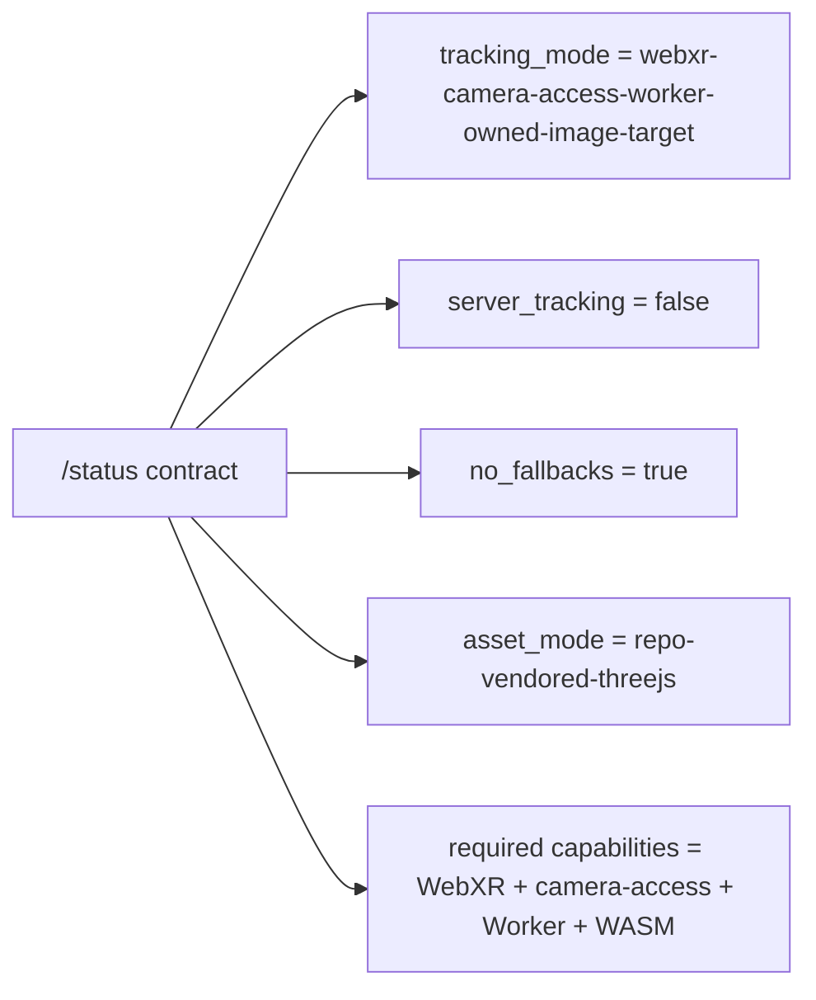
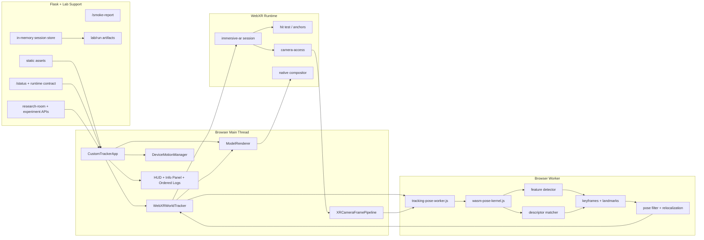
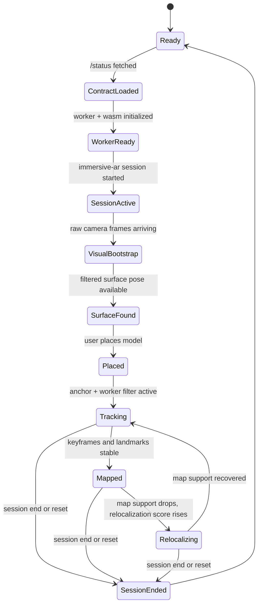
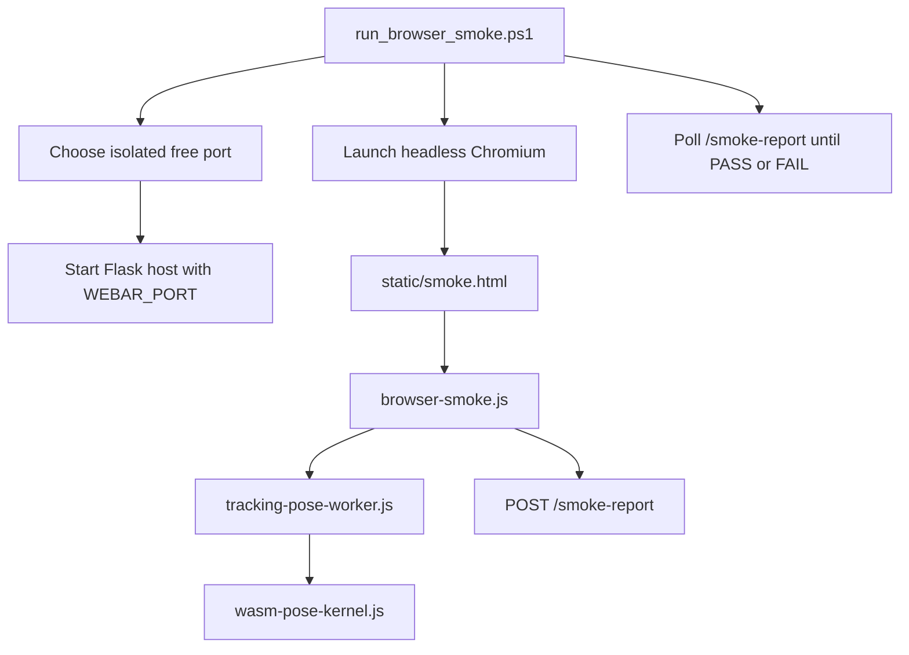
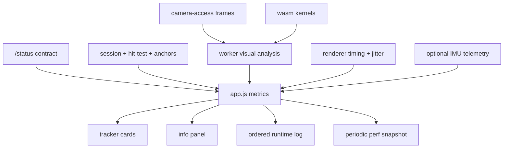

# System Design

Date: 2026-03-23

## Overview

The active system is a strict client-side runtime with a thin research backend:
- WebXR provides world tracking, hit tests, anchors, camera access, and display timing.
- The browser worker owns repo-side pose filtering, feature extraction, matching, keyframe state, relocalization scoring, and visual diagnostics.
- The WASM module provides low-level math and vision kernels used by the worker.
- Flask serves static assets plus the runtime contract, research-room APIs, active-experiment state, smoke-report ingestion, and reconstruction-session history.
- Backend persistence is limited to lab metadata and throttled session artifacts; it is not part of the tracking hot path.
- There are no fallback tracking paths.

## Runtime Contract

## Runtime Architecture

## Session and Tracking Flow

## Browser Validation Architecture

The current browser smoke path is stronger than a pure startup test because it feeds synthetic frames and a measurement into the worker and asserts feature extraction, matching, keyframe creation, relocalization output, and pose emission. But it is still a deterministic worker sanity check, not a full runtime-correctness harness for immersive AR behavior.

## Component Responsibilities

### `app.py`
- creates the Flask app, registers routes, and keeps runtime constants in one place
- exposes `/status`, research-room APIs, session APIs, and `/smoke-report`
- wires the backend support modules together without joining the tracking hot path

### `webar_backend/common.py`
- centralizes backend logging, timestamp formatting, telemetry coercion, and summary helpers
- keeps session summarization and runtime log formatting consistent across routes

### `webar_backend/lab.py`
- owns the `lab/` workspace contract
- manages the research program document, active experiment payload, connection hints, and saved run artifacts
- builds the research-room payload shared by desktop lab tooling

### `webar_backend/session_store.py`
- maintains the bounded in-memory session buffer fed by `/frontend-telemetry`
- persists throttled session artifacts to disk so session history survives server restarts
- lets `/api/reconstruction-sessions/<detailId>` reopen either live sessions or persisted run artifacts

### `static/js/app.js`
- bootstraps the app and fetches the architecture contract
- coordinates session start, UI state, runtime summaries, and ordered logs
- surfaces worker, wasm, visual, capture, architecture, and render diagnostics together
- tunes capture size and cadence to protect XR frame rate

### `static/js/webxr-world-tracker.js`
- requests the `immersive-ar` session with required features
- manages hit tests, placement, optional anchors, worker messaging, and session diagnostics
- routes both pose measurements and visual frames into the worker
- consumes worker-filtered poses only

### `static/js/xr-camera-frame-pipeline.js`
- captures raw XR camera textures through `XRWebGLBinding.getCameraImage()`
- downsamples on GPU, reads back on CPU, and backpressure-limits worker submission
- keeps visual ingestion separate from XR compositor scale so quality and performance can be tuned independently

### `static/js/tracking-pose-worker.js`
- decomposes measurement matrices into translation and rotation state
- extracts image features on a grid from raw frames
- builds tiny descriptors, matches tracks, estimates image motion, and updates map state
- stores keyframes and lightweight landmarks
- computes relocalization support and feeds it into pose confidence
- returns filtered poses plus dense debugging metrics

### `static/js/wasm-pose-kernel.js`
- builds a small in-repo WebAssembly module without external tooling
- exports scalar helpers plus vision kernels used by the worker
- currently accelerates luminance, gradients, corner score, descriptor distance, and filter math

### `static/js/model-renderer.js`
- owns Three.js scene setup, model loading, XR-compatible rendering, and world-space model transforms
- consumes only filtered poses from the world tracker
- reports frame time, pose age, jitter, and render state back to the app

### `static/js/device-motion.js`
- collects optional motion telemetry for debugging
- is intentionally not a fallback tracker
- is a candidate source for future visual-inertial fusion experiments

### `static/index.html`
- exposes the start flow, tracker cards, architecture section, deep info panel, and ordered log stream
- keeps the development UI focused on proving whether the runtime contract and each subsystem are active

### `static/js/session-dashboard.js`
- renders the reconstruction-session list and detail view from the backend session APIs
- uses stable `detailId` routing so persisted runs can still be reopened after the live in-memory buffer is gone

## Telemetry Surface

The current telemetry surface is broad, but it is still primarily subsystem-oriented. It answers whether modules are alive, not yet the deeper estimator questions needed for research iteration.

## Research Telemetry Model

For the roadmap toward a metric estimator, telemetry should be grouped around research questions rather than UI subsystems.

### Input Quality
- frame sharpness and contrast trends
- feature density and spatial coverage
- motion observability indicators
- camera backpressure and dropped-frame rate

### Tracking Quality
- reprojection error trend
- inlier ratio and absolute inlier count
- feature track lifetime distribution
- pose residuals and filter innovation magnitude
- pose drift against the native WebXR baseline

### Map Health
- keyframe growth rate over time
- stable landmark growth rate over time
- stale landmark ratio
- track-to-landmark promotion ratio
- map-support confidence and keyframe reuse ratio

### Relocalization Behavior
- time-to-relocalize
- relocalization attempt count per minute
- relocalization precision and recall proxies
- relocalization false-positive rate
- confidence before and after relocalization transitions

### Latency Budget
- camera ingest time
- worker queue time
- worker compute time
- render-to-display time
- end-to-end pose age at render

### Native Baseline Comparison
- translation delta vs native WebXR pose
- rotation delta vs native WebXR pose
- drift accumulation over path length
- disagreement rate during relocalization windows

Research-grade telemetry should make it possible to answer:
- what input conditions predict tracking failure
- whether the estimator is improving or only appearing stable through filtering
- whether map growth is healthy or simply accumulating stale state
- whether relocalization recovers true pose or creates plausible but wrong locks

## Current System Boundary

The current system provides:
- client-only tracking hot path
- raw XR camera ingestion into the worker
- worker-side feature tracking, matching, keyframe state, and relocalization support
- repo-owned WASM vision kernels
- vendored runtime assets
- explicit architecture contract and browser smoke validation
- bounded in-memory telemetry aggregation with throttled disk-backed run artifacts
- research-room and dashboard APIs that can reopen persisted session history after a restart
- deterministic worker sanity checks with synthetic browser-driven inputs
- no fallback tracking modes

The current system does not yet provide:
- estimator-oriented telemetry sufficient for drift, observability, and relocalization-quality research
- repo-owned visual-inertial odometry replacing native WebXR world tracking
- persistent 3D map optimization and loop closure
- IMU fusion into the estimator
- cross-session map reuse or cloud localization
- immersive-session correctness testing under real camera-access and timing pressure
- VPS, semantic understanding, depth mesh, or occlusion reconstruction

## Validation Roadmap

The validation stack should be layered rather than treated as one smoke pass.

### Contract Tests
- verify `/status` matches the actual enabled code paths and runtime flags
- assert required capabilities and no-fallback promises are internally consistent

### Deterministic Worker Tests
- feed recorded or synthetic frame sequences and measurements into the worker offscreen
- assert feature counts, match counts, keyframe creation rules, relocalization score trends, and filter output bounds

### Timing and Pressure Tests
- simulate queue pressure and confirm that the system drops frames instead of allowing latency to grow without bound
- verify camera capture cadence, worker latency, and pose age remain inside explicit envelopes

### Session-State Tests
- exercise session start, sparse-feature mode, relocalization entry and exit, reset, and camera-loss scenarios
- assert state-transition ordering instead of only checking that messages are emitted

### Immersive Runtime Tests
- validate capability negotiation, camera-access behavior, and session behavior inside `immersive-ar`
- compare worker pose behavior against native WebXR baseline during controlled motion sequences

The current smoke harness remains useful as a boot and worker-sanity test, but correctness for the research roadmap requires the full ladder above.

## Research Direction

The natural next step is to evolve the worker from image-space tracking support into a metric estimator:
1. triangulate stable landmarks into 3D state
2. estimate camera motion from visual tracks instead of only supporting native world poses
3. fuse IMU in the worker update loop
4. add keyframe optimization and relocalization against a persistent map
5. measure live-device error, drift, latency, and relocalization success as first-class experiment outputs
